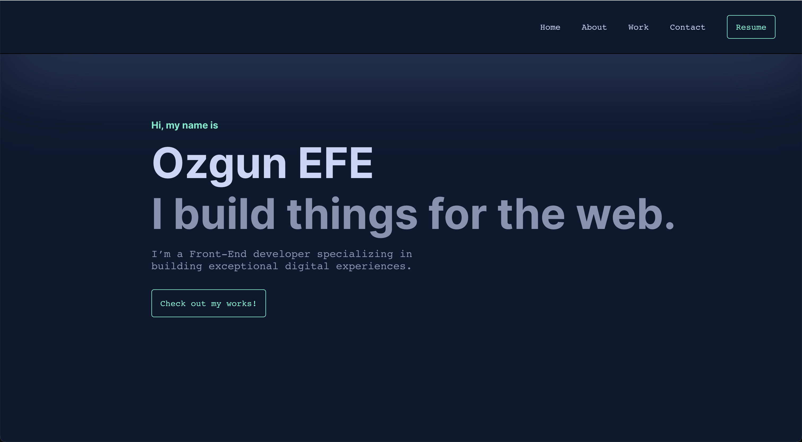
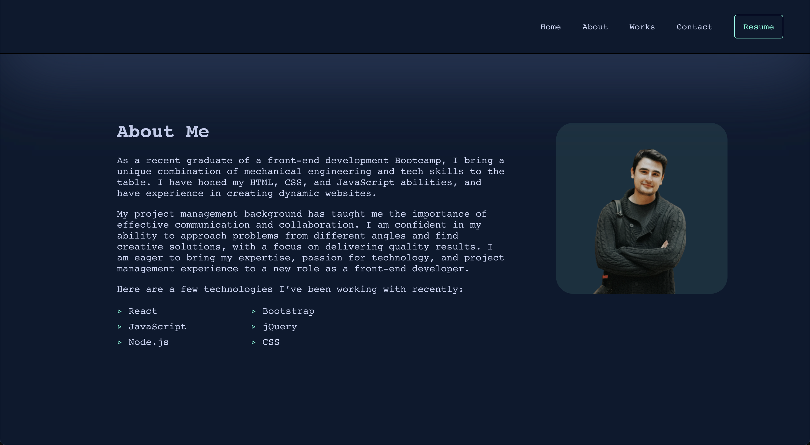
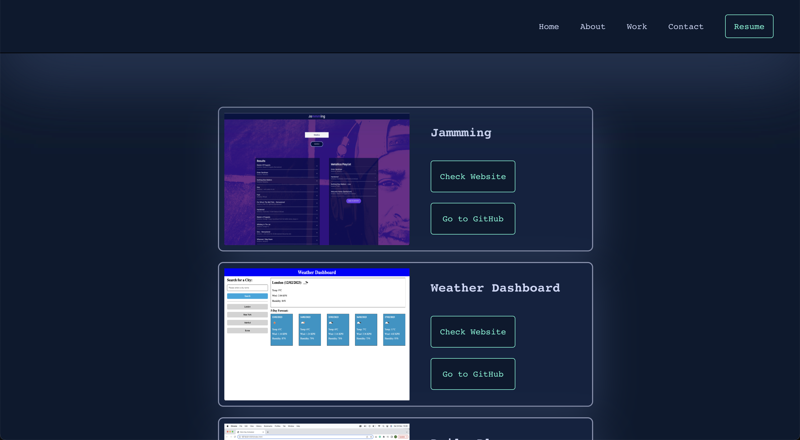
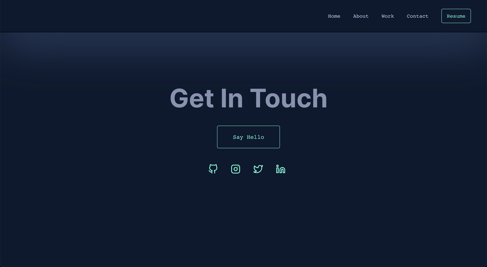

# Ozgun Efe Portfolio
## Description
I created a personal portfolio website using [React](https://create-react-app.dev/) and [React Router](https://reactrouter.com/en/main/start/tutorial).

- For the Works page, I created a JSON file and got data from this file. I used the **.map()** feature to list each item.
- For the Navigation section, I used the **React Router** and I made the connections with **NavLink**.
- I used [Netlify](https://www.netlify.com/) for deployment.

### Live Link
[Check out my website](https://silver-hummingbird-171dad.netlify.app/) :rocket:

I was inspired by [this Design](https://brittanychiang.com/).

## Screenshots
### Home Page

### About Me

### Works

### Contact

